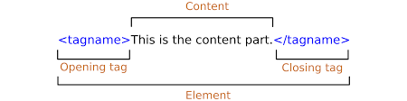
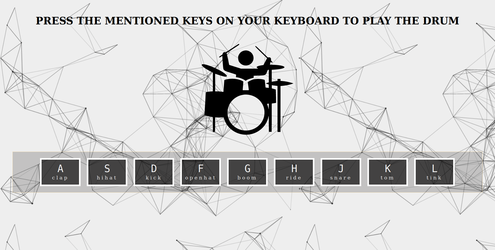

# DRUM KIT
On hitting the key on the keyboard the sound associated with that key will be played and the key will be animated.  



## `data-*` attribute 
The `data-*` attribute gives us the ability to embed custom data attributes on all html elements.  
The attribute name should not contain any uppercase letters, and must be at least one character long after the prefix "data-".  
eg: `<li data-animal-type="bird"> owl</li>`

## attribute selector
- The [attribute] selector is used to select elements with a specified attribute.   
This will style all the `<a>` elements which have target as an attribute in them.

```css
a[target]{
    color:red;
}
```
- The [attribute="value"] selector is used to select elements with a specified attribute and value.  
This styles all `<a>` elements with a target="_blank" attribute:
```css
a[target="_blank"] {
  background-color: yellow;
}
```
## Audio DOM  reference
`const audio=document.querySelector('#audioId')`
- audio.currentTime  
The currentTime property sets or returns the current position (in seconds) of the audio/video playback.  
When setting this property, the playback will jump to the specified position.
- audio.play()  
The play() method starts playing the current audio or video.

## Events
- keydown  and keyup event  
The keydown event is fired for all keys, regardless of whether they produce a character value.  
KeyDown occurs when the user presses a key.  
KeyUp occurs when the user releases a key.
- transitionend event  
The transitionend event occurs when a CSS transition has completed.  
`object.addEventListener("transitionend", myScript);`

## NodeList vs Array 
- A NodeList object is a list (collection) of nodes extracted from a document.
- Most browsers return a NodeList object for the method querySelectorAll().
- A NodeList may look like an array, but it is not.
-  create an Array from a NodeList : ` Array.from()`

## Screenshot
