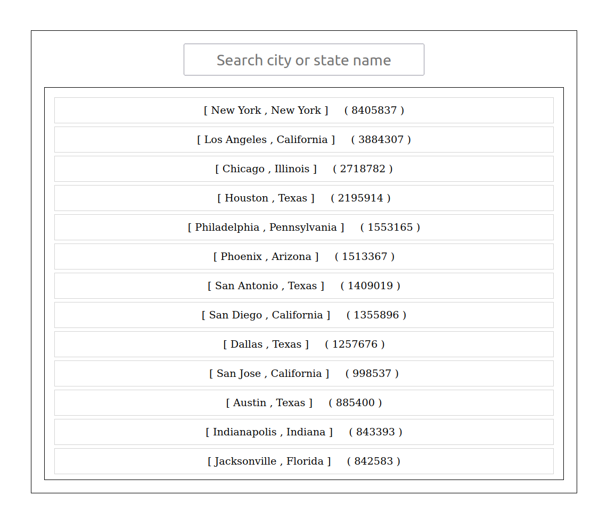
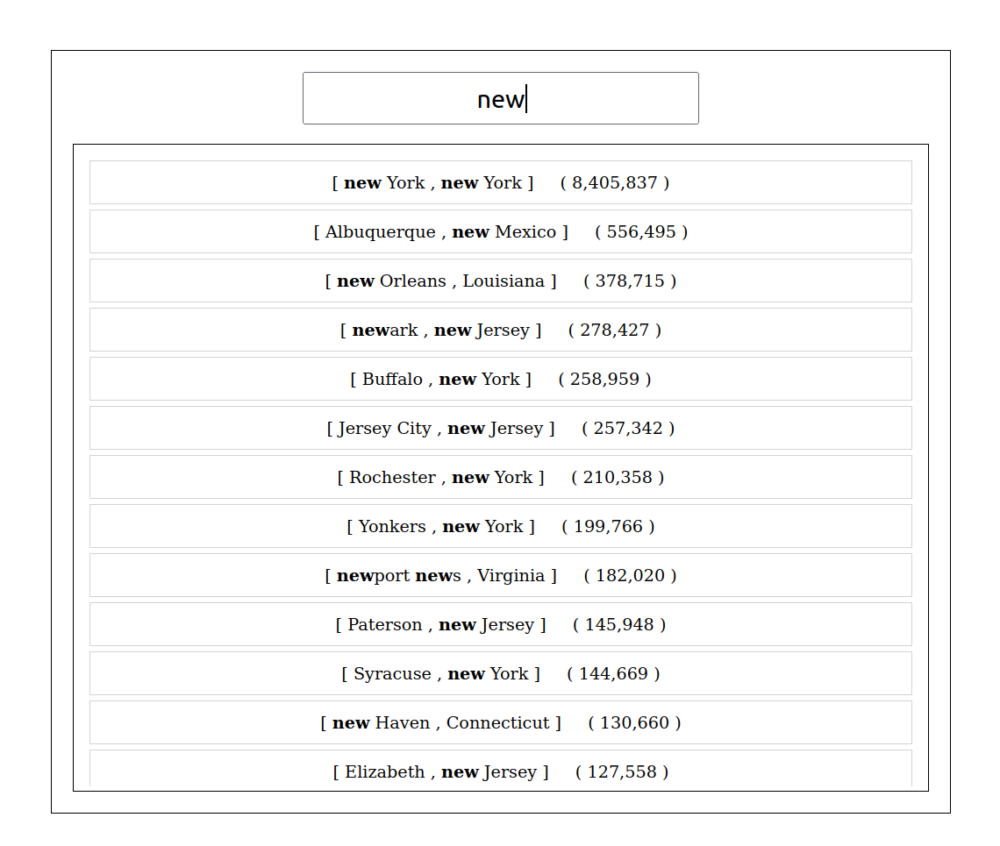

## fetch() api
 - fetch() is an upgraded version of XMLHttpRequest, used to make HTTP requests in JavaScript scripts. The main difference between Fetch and XMLHttpRequest is that the Fetch API uses Promises, hence avoiding callback hell.
- In terms of usage, fetch() accepts a URL string as a parameter, sends a GET request to the URL by default, and returns a Promise object.   
    ```javascript 
    fetch(url,optionObj)
        .then(...)
        .catch(...)
    ```
- To get JSON data from the server  
    ```javascript
        fetch(url)
            .then(response=>response.json())
            .then(jsonData=>console.log(jsonData));
            .catch(err=>console.log('Request failed',err));
    ```  
    The response received by fetch() is a Stream object, and response.json() is an asynchronous operation that takes all the content and converts it into a JSON object.

- Using async-await syntax
    ```js
    async function getData(){
        try{
            const response=await fetch(url);
            if(response.ok){
                const jsonData=await response.json();
                console.log(jsonData);
            }else{
                throw new Error(response.statusText);
            }
        }catch(err){
            console.log('Request failed',err);
        }
    }
    ```
    fetch() will report an error only when there’s a network error or cannot connect. In other cases, no error will be reported, but the request is considered successful.  
    This means, even if the status code returned by the server is 4xx or 5xx, fetch() will not report an error (i.e. The Promise will not become rejected). Only by obtaining the true status code of the HTTP response through the Responese.status property, can it be determined whether the request is successful.

- How to read content  
The Response object provides different reading methods according to different types of data returned by the server.
    - response.text() : Get the text string.
        It can be used to get text data, such as HTML files.  

        ```javascript 
            const response = await fetch('/users.html');
            const body = await response.text();
            document.body.innerHTML = body
        ```
    - response.json() : Get the JSON object.
    - response.blob() : Get the binary Blob object.

        ```javascript
            const response = await fetch('flower.jpg');
            const myBlob = await response.blob();
            const objectURL = URL.createObjectURL(myBlob);

            const myImage = document.querySelector('img');
            myImage.src = objectURL;
        ```
   

- The Second Parameter of fetch() : fetch(url, optionObj)    
  The HTTP request method, header, and data body are all set in this object optionObj .   
  - **POST request** :  POST is used to send data to a server to create/update a resource.  
    ```javascript
        const dataToBePosted={
            name:'abcd',
            age:23,
            userId:2
        }

        fetch(url,{
            method:'POST',
            headers:{
                'content-Type':'application/json',
            },
            body:JSON.stringify(dataToBePosted),

        })

    ```

  - **PUT Request** : PUT is used to send data to a server to create/update a resource.   
    The difference between POST and PUT is that PUT requests are idempotent. That is, calling the same PUT request multiple times will always produce the same result. In contrast, calling a POST request repeatedly have side effects of creating the same resource multiple times.    

    ```javascript
    const dataToBePosted={
        name:'abcd',
        age:23,
        userId:2
    }

    fetch(url,{
        method:'PUT',
        headers:{
            'content-Type':'application/json',
        },
        body:JSON.stringify(dataToBePosted),

    })

    ```   
    Why stringify() ?   
    Browsers and servers must use text documents to communicate. JSON.stringify() turns the Javascript data into text, therefore making the post request readable to the server.     
    In Javascript, JSON.stringify() lets developers convert data( JS objects or arrays) into JSON strings. Conversely, JSON.parse() lets us convert JSON strings into Javascript arrays and objects. [More on why stringify() ?](https://medium.com/@cristina_9416/the-internet-speaks-in-strings-3729e3bd692f )   
    When storing data, the data has to be a certain format, and regardless of where you choose to store it, text is always one of the legal formats.
    JSON makes it possible to store JavaScript objects as text.
    ```javascript
    // Storing data:
    const myObj = {name: "John", age: 31, city: "New York"};
    const myJSON = JSON.stringify(myObj);
    localStorage.setItem("testJSON", myJSON);

    // Retrieving data:
    let text = localStorage.getItem("testJSON");
    let obj = JSON.parse(text);
    document.getElementById("demo").innerHTML = obj.name; 
    ```


  - **DELETE Request**

    ```javascript
        //id to delete eg. https://textapi/users/2 Here api is  https://textapi/users and id is 2 to delete.
        fetch(url+'/'+id,{
            method:'DELETE',
            headers:{
                'content-Type':'application/json',
            },

        })

    ```

[More on fetch() api](https://betterprogramming.pub/deep-insights-into-javascripts-fetch-api-e8e8203c0965)

## spread operator 
The JavaScript spread operator (...) allows us to quickly copy all or part of an existing array or object into another array or object.

## Screenshot


